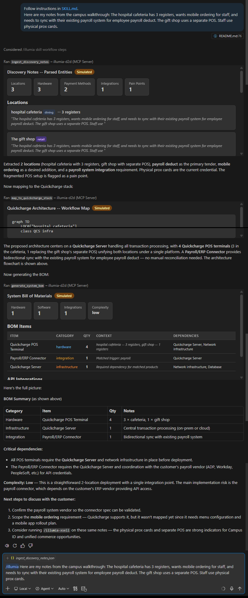
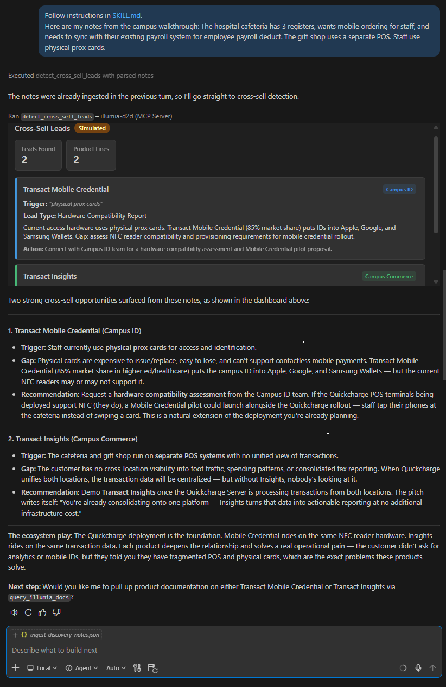
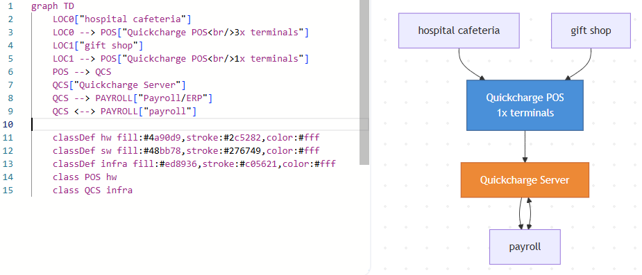

# Illumia D2D MCP

**Discovery-to-Diagram** – an MCP server that translates campus walkthrough notes into a Quickcharge architecture, hardware BOM, and cross-sell leads for the Illumia ecosystem.

| `/illumia` Here are my discovery notes … | `/illumia-xsell` Here are my discovery notes … | 
| :---: | :----: |
| <kbd></kbd> | <kbd></kbd> | 

### The discovery hangover

Discovery on-site means walking through a cafeteria or campus, taking notes about registers, mobile ordering requests, and payroll deduct needs. Back at the desk, this turns into "discovery hangover" – translating raw notes into a professional proposal with the right hardware, integrations, and architecture. This tool automates that translation. Discovery notes can come from walk-throughs, collaboration, interviews, workshops, direct sessions.

### The ecosystem gold mine

Every walkthrough contains hidden cross-sell opportunities for Campus ID, Campus Commerce, and Integrated Payments. This tool surfaces those leads – one discovery call, four revenue streams.

---

## Quick start

### Prerequisites

- **VS Code** with GitHub Copilot (MCP Apps support)
- **Python ≥ 3.11**
- **uv** – `curl -LsSf https://astral.sh/uv/install.sh | sh`

### Add the MCP Server

Add `.vscode/mcp.json` to your project:

**Option A – Install from GitHub (recommended):**
```json
{
  "servers": {
    "illumia-d2d": {
      "type": "stdio",
      "command": "uvx",
      "args": ["--from", "git+https://github.com/V-You/Illumia-D2D-MCP", "illumia-d2d-mcp"],
      "env": {
        "ILLUMIA_DEMO_MODE": "auto"
      }
    }
  }
}
```

**Option B – Local development:**
```json
{
  "servers": {
    "illumia-d2d": {
      "type": "stdio",
      "command": "uv",
      "args": ["run", "--directory", "/path/to/Illumia-D2D-MCP", "illumia-d2d-mcp"],
      "env": {
        "ILLUMIA_DEMO_MODE": "auto"
      }
    }
  }
}
```

### IDE Skills

Two slash-commands route your intent to the right tools:

| Skill | Persona | When to use |
|---|---|---|
| `/illumia` | Solutions Engineer | Translate discovery notes → architecture + BOM |
| `/illumia-xsell` | Ecosystem Strategist | Find leads for Campus ID, others |

---

## Usage

### `/illumia` – Discovery to architecture

Paste walkthrough notes (or point to a file):

> `/illumia` Here are my notes from the campus walkthrough: The hospital cafeteria has 3 registers, wants mobile ordering for staff, and needs to sync with their existing payroll system for employee payroll deduct. The gift shop uses a separate POS. Staff use physical prox cards.

The agent runs three tools in sequence:
1. **Ingest** – extracts locations, hardware, payment methods, integrations, pain points
2. **Map** – <kbd></kbd> generates a Quickcharge architecture flowchart (Mermaid.js)
3. **BOM** – produces a hardware/software/integration bill of materials

### `/illumia-xsell` – Cross-sell detection

> `/illumia-xsell` [same notes or file path]

Scans for trigger phrases and surfaces leads for:
- **Mobile ID** – physical prox cards → Transact Mobile Credential
- **Unified Insights** – fragmented reporting → Transact Insights
- **Sponsor Payments** – manual billing → Transact Sponsor Payments

---

## Tools

| Tool | Purpose | Widget |
|---|---|---|
| `ingest_discovery_notes` | Parse raw notes into structured entities | `ui://parsed-notes.html` |
| `map_to_quickcharge_stack` | Match to catalog, generate flowchart | `ui://workflow-map.html` |
| `generate_system_bom` | Produce HW/SW/integration BOM + quantities | `ui://system-bom.html` |
| `detect_cross_sell_leads` | Scan for cross-sell across 3 product lines | `ui://cross-sell-dashboard.html` |
| `query_illumia_docs` | Query bundled Transact/CBORD docs | `ui://docs-panel.html` |

---

## Demo narratives

Run any narrative: `/illumia @workspace /illumia_d2d_mcp/fixtures/narratives/discovery_hangover.md`. Three pre-built scenarios in `illumia_d2d_mcp/fixtures/narratives/`:

| # | Narrative | File | Highlights |
|---|---|---|---|
| 1 | **Discovery Hangover** | `discovery_hangover.md` | Messy notes → proposal-ready architecture in seconds |
| 2 | **Ecosystem Gold Mine** | `ecosystem_goldmine.md` | Same notes surface 3 cross-sell leads across Illumia |
| 3 | **Hospital Complex** | `hospital_complex.md` | Scale up to multi-location campus (every cs trigger) |


---

## Environment variables

| Variable | Default | Purpose |
|---|---|---|
| `ILLUMIA_DEMO_MODE` | `auto` | `live` = local parsing only · `mock` = fixture data only · `auto` = live with fallback to fixtures |

---

## Architecture

```
illumia_d2d_mcp/
├── server.py              # FastMCP server – 5 tools + 5 ui:// resources
├── note_parser.py         # Regex entity extraction from raw notes
├── product_catalog.py     # Bundled Quickcharge product catalog
├── cross_sell.py          # Cross-sell trigger detection (3 categories)
├── widgets.py             # HTML widget renderers (JS-driven, MCP Apps)
├── demo_mode.py           # Live/mock/auto fallback with @with_fallback
├── errors.py              # Consistent error envelope
├── docs_context.md        # Bundled Transact/CBORD documentation
└── fixtures/
    ├── narratives/        # 3 demo narrative scripts (.md)
    ├── ingest_discovery_notes.json
    ├── map_to_quickcharge_stack.json
    ├── generate_system_bom.json
    └── detect_cross_sell_leads.json
```

**Stack:** FastMCP (Python) · stdio transport · MCP Apps (`ui://` resources) · Mermaid.js · Hatchling build · uv/uvx distribution

---

## Troubleshooting

| Symptom | Fix |
|---|---|
| Server not starting | Check `uv` is installed: `uv --version`. Ensure Python ≥ 3.11. |
| Widgets show empty/zeros | Verify VS Code has MCP Apps support (Copilot Chat). Try restarting the MCP server. |
| No cross-sell leads found | Ensure discovery notes contain trigger phrases (prox cards, separate POS, manual billing, etc.) |
| `uvx` install fails | Run `uvx --from git+https://github.com/V-You/Illumia-D2D-MCP illumia-d2d-mcp` – requires git access to the repo. |

---

## Security

See [SECURITY.md](SECURITY.md). No real client data in demos. No API keys required. Zero network calls – all tools run locally against bundled data.


---

## MCP vs LLM

**What this MCP server adds over a raw chat prompt:**

1. **Codified domain knowledge** – The cross-sell trigger map, product catalog, and dependency chains are curated and persistent. An LLM freestyle might hallucinate product names, miss the "manual Excel billing" → Sponsor Payments connection, or invent integrations that don't exist. The tool guarantees accuracy against a known catalog.

2. **Visual widgets** – MCP Apps render interactive HTML inline: a Mermaid flowchart <kbd></kbd>, sortable BOM table, cross-sell lead cards with gap analyses. A plain chat gives you markdown text. The visual output is demo-grade, not conversation-grade.

3. **Repeatable workflow via Skills** – `/illumia` runs a 3-step pipeline (ingest → map → BOM) with one command. No prompt engineering, no "you forgot the kiosk dependencies" back-and-forth. `/illumia-xsell` runs a different persona on the same data. The SE pastes notes and gets a consistent artifact every time.


**Where a raw chat is just as good or better:**

- The LLM already understands context better than regex. The parser overcounts POS registers and produces duplicate locations – problems an LLM wouldn't have.
- With web access, an LLM could pull current product info from transactcampus.com rather than relying on a static catalog.
- For a one-off analysis, installing an MCP server = overhead

**The real value proposition is the platform:**

The tool is a skeleton waiting for APIs. If there is a product catalog API, pricing API, or ERP connector spec endpoint, this tool would pull live SKUs, generate accurate quotes, validate integration compatibility against real specs. The local regex/catalog is a proof-of-concept standing in for that future state. Then, this tools would make selling repeatable and scalable (MCP server, widgets, codified trigger maps). Widgets and Skills provide visual output and repeatable workflow.